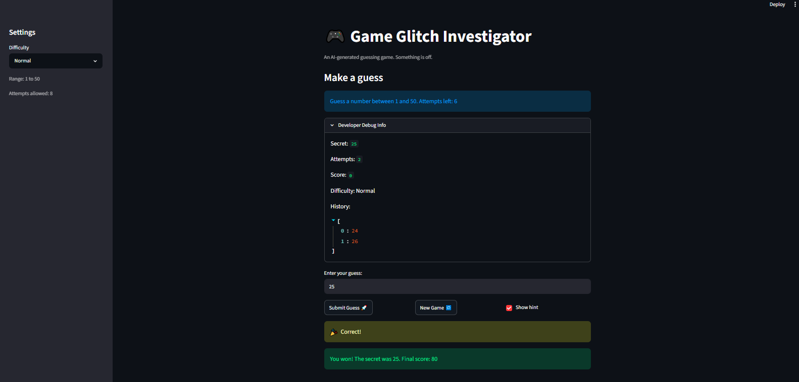

# 🎮 Game Glitch Investigator: The Impossible Guesser

## 🚨 The Situation

You asked an AI to build a simple "Number Guessing Game" using Streamlit.
It wrote the code, ran away, and now the game is unplayable. 

- You can't win.
- The hints lie to you.
- The secret number seems to have commitment issues.

## 🛠️ Setup

1. Install dependencies: `pip install -r requirements.txt`
2. Run the broken app: `python -m streamlit run app.py`

## 🕵️‍♂️ Your Mission

1. **Play the game.** Open the "Developer Debug Info" tab in the app to see the secret number. Try to win.
2. **Find the State Bug.** Why does the secret number change every time you click "Submit"? Ask ChatGPT: *"How do I keep a variable from resetting in Streamlit when I click a button?"*
3. **Fix the Logic.** The hints ("Higher/Lower") are wrong. Fix them.
4. **Refactor & Test.** - Move the logic into `logic_utils.py`.
   - Run `pytest` in your terminal.
   - Keep fixing until all tests pass!

## 📝 Document Your Experience

- [x] **Describe the game's purpose.**

  Game Glitch Investigator is a Streamlit number-guessing game. The app picks a secret number within a range that depends on the chosen difficulty (Easy, Normal, or Hard), and the player tries to guess it within a limited number of attempts. After each guess the game gives a "higher/lower" hint, tracks the score and guess history, and lets the player start a fresh round with a "New Game" button.

- [x] **Detail which bugs you found.**

  - **Reversed hints:** a guess that was too high told the player to "Go HIGHER!" and vice versa, sending them the wrong direction.
  - **Inverted difficulty scaling:** "Normal" used a 1–100 range while "Hard" used 1–50, so Normal was actually wider (harder) than Hard.
  - **Disappearing/erratic secret:** on every other attempt the code cast the secret to a string before comparing, which broke the comparison and made the hints unreliable.
  - **Attempt counted before any guess:** the attempt counter started at 1, so the player lost an attempt before submitting anything.
  - **"New Game" didn't reset state:** clicking it changed the secret but left the score, history, and won/lost status in place, so the board stayed frozen until a manual page refresh.
  - **Wrong scoring:** a wrong ("Too High") guess could *add* points on even attempts instead of leaving the score unchanged.

- [x] **Explain what fixes you applied.**

  - Refactored the four core functions (`get_range_for_difficulty`, `parse_guess`, `check_guess`, `update_score`) out of `app.py` into `logic_utils.py` and imported them back in.
  - Corrected the hint messages in `check_guess` so "Too High" says "Go LOWER!" and "Too Low" says "Go HIGHER!", and removed the broken string-comparison branch.
  - Swapped the difficulty ranges so Normal (1–50) is strictly smaller than Hard (1–100).
  - Removed the every-other-attempt `str(secret)` cast in `app.py` so guesses are always compared as integers.
  - Set the initial attempt count to 0 and updated the prompt to show the difficulty's real range instead of a hardcoded "1 to 100".
  - Made "New Game" fully reset the secret (within the current range), attempts, score, history, and status, so no manual refresh is needed.
  - Cleaned up `update_score` so only a win changes the score, scaled to reward fewer attempts.
  - Added targeted `pytest` regression tests in `tests/test_game_logic.py` for each fixed bug — all 8 pass.

## 📸 Demo Walkthrough

Describe your fixed game in numbered steps so a reader can follow along without watching a video:

1. **Launch the app** with `python -m streamlit run app.py` and open it in the browser. The page loads on "Normal" difficulty showing "Attempts left: 8" — note it now correctly starts at the full count instead of having one attempt already used.
2. **Pick a difficulty** in the sidebar. The range scales correctly now: Easy is 1–20, Normal is 1–50, and Hard is 1–100, so harder difficulty means a wider range. The on-screen prompt updates to show the real range for the selected difficulty.
3. **Make a guess** by typing a number and clicking "Submit Guess 🚀". Use the "Developer Debug Info" expander to peek at the secret while testing. The secret stays the same across submissions — it no longer changes on every click.
4. **Read the hint.** Guess too high and it correctly tells you to "Go LOWER!"; guess too low and it says "Go HIGHER!" — the hints now point you in the right direction every time, including on every other attempt where they used to break.
5. **Win the game.** Enter the secret number and the app shows balloons, a win message with the secret revealed, and your final score (more points for winning in fewer attempts).
6. **Click "New Game 🔁".** The game fully resets without a manual refresh: a new secret is generated within the current difficulty's range, attempts return to 0, the score resets, the history clears, and the board becomes playable again.
7. **Run the tests** with `pytest` to confirm all 8 logic tests pass (see Test Results below).

**Screenshot** *(optional)*: <!-- Insert a screenshot of your fixed, winning game here -->


## 🧪 Test Results

```
============================= test session starts =============================
platform win32 -- Python 3.14.5, pytest-9.1.0, pluggy-1.6.0 -- C:\Users\ibrahim azeem\AppData\Local\Python\pythoncore-3.14-64\python.exe
cachedir: .pytest_cache
rootdir: C:\Users\ibrahim azeem\Desktop\ai110-module1show-gameglitchinvestigator-starter
plugins: anyio-4.14.0
collecting ... collected 8 items

tests/test_game_logic.py::test_winning_guess PASSED                      [ 12%]
tests/test_game_logic.py::test_guess_too_high PASSED                     [ 25%]
tests/test_game_logic.py::test_guess_too_low PASSED                      [ 37%]
tests/test_game_logic.py::test_too_high_hint_tells_user_to_go_lower PASSED [ 50%]
tests/test_game_logic.py::test_too_low_hint_tells_user_to_go_higher PASSED [ 62%]
tests/test_game_logic.py::test_normal_range_is_smaller_than_hard_range PASSED [ 75%]
tests/test_game_logic.py::test_wrong_guess_does_not_change_score PASSED  [ 87%]
tests/test_game_logic.py::test_win_awards_more_points_for_fewer_attempts PASSED [100%]

============================== 8 passed in 0.14s ==============================
```

## 🚀 Stretch Features

- [ ] [If you choose to complete Challenge 4, describe the Enhanced UI changes here — a screenshot is optional]
